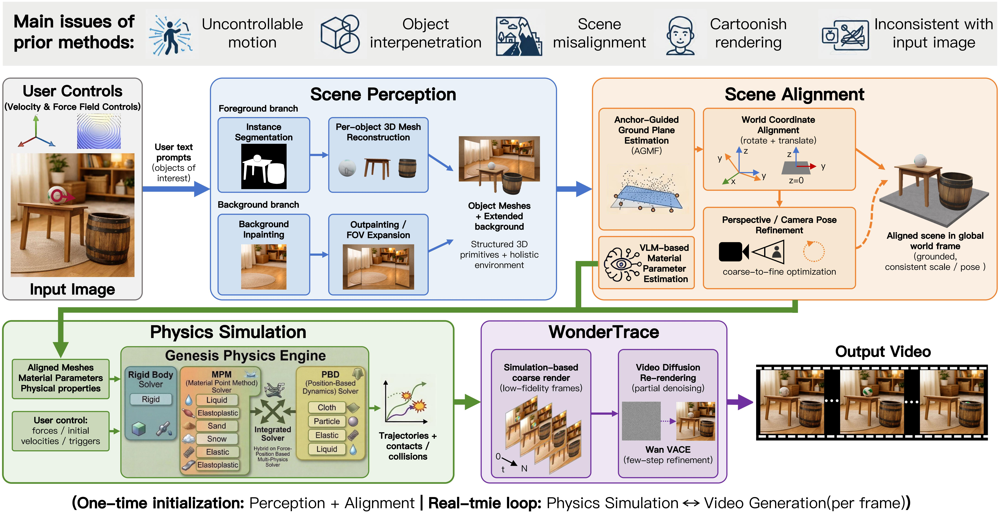

# TelePhysics: Physics-Grounded Multi-Object Scene Generation from a Single Image

[](https://arxiv.org/abs/2605.20290)
[](https://telephysics.github.io/)
[](assets/paper.pdf)

TelePhysics is a unified, training-free framework for holistic 3D scene generation and physically grounded video synthesis from a single input image. It supports multi-object scene reconstruction, physics simulation, and video generation with realistic interactions across diverse materials.

Supported physics materials include **rigid bodies**, **elastic solids**, **sand**, **elastoplastic materials**, **cloth**, and **liquid**.

**Authors:**  
Xin Zhang, Yabo Chen, Yijie Fang, Wanying Qu, Haibin Huang, Chi Zhang, Feng Xu, Xuelong Li

---

## 🌐 Pipeline Overview



---

## 🚀 Quick Start

### Requirements

- Linux, tested on Ubuntu 20.04+
- CUDA 12.6
- Conda

---

### Installation

Install all dependencies with:

```bash
bash environments/install.sh
```

This script creates two conda environments:

| Environment | Purpose |
|---|---|
| `telephysics-pq` | Segmentation and 3D mesh generation, based on PyTorch 2.8.0 + CUDA 12.6 |
| `telephysics-sr` | Physics simulation, depth estimation, and video synthesis |

---

### Download Models

Download all required models with:

```bash
bash environments/download.sh
```

The models will be downloaded into `./models/`.

| Model | Purpose |
|---|---|
| `facebook/sam3` | Text-prompted image segmentation |
| `facebook/sam-3d-objects` | Single-image 3D mesh reconstruction |
| `facebookresearch/dinov2` | Vision backbone for SAM3D |
| `Ruicheng/moge-vitl` | Monocular geometry estimation |
| `depth-anything/Video-Depth-Anything` | Per-frame depth estimation, ViT-S / ViT-L |
| `smartywu/big-lama` | Background inpainting |
| `PAI/Wan2.2-VACE-Fun-A14B` | Video synthesis, high/low noise denoiser |
| `DiffSynth-Studio/Wan-Series-Converted-Safetensors` | VAE + T5 encoder |
| `Wan-AI/Wan2.1-T2V-1.3B` | UMT5-XXL text tokenizer |

---

### Inference

Run the full pipeline on the provided `ball` example:

```bash
bash scripts/run.sh
```

The output video will be saved to:

```bash
demo/output_ball/wan/rendered_ball.mp4
```

---

### Run on Your Own Image

To test TelePhysics with your own image, edit the variables at the top of `scripts/run.sh`:

```bash
ROOT_DIR="data"          # directory containing scene folder
NAME="ball"              # scene name, used as folder name and image stem
TEXT_PROMPT="ball"       # space-separated object text prompts
OUTPUT_DIR="demo/output_${NAME}"
MOVE=0                   # camera movement: 0=static, 1-4=orbit, 5=dolly-out, 6=dolly-in
```

Place your image at:

```bash
data/{NAME}/{NAME}.png
```

For example:

```bash
data/ball/ball.png
```

The pipeline will automatically generate a `config.yaml` for the scene if one is not provided.

---

## 📁 Data Layout

The expected data structure is:

```bash
data/
└── {scene_name}/
    ├── {scene_name}.png     # input image
    └── config.yaml          # physics configuration, auto-generated or manually edited
```

Three example scenes are included:

- `ball`
- `dress`
- `sandhouse`

---

## 🎛️ Scene Configuration

Each scene is controlled by:

```bash
data/{scene_name}/config.yaml
```

All fields are optional. Default values will be applied automatically.

```yaml
simulation:
  n_steps: 300          # total simulation steps
  fps: 60               # output frame rate
  camera_mv: 0          # camera movement, 0=static, 1-6=various motions

objects:
  0:
    material: "rigid"   # rigid | mpm_elastic | mpm_elastoplastic |
                        # mpm_sand | pbd_cloth | sph_liquid
    fixed: false
    start_frame: 0
    velocity: [0.0, 0.0, 0.0]   # initial linear velocity, m/s

forces:
  - type: "wind"
    direction: [1, 0, 0]
    strength: 5.0
```

For the full configuration reference, including material parameters, force fields, and camera alignment controls, please see:

```bash
configs/example_config.yaml
```

Supported force fields include:

- constant force
- wind
- point force
- drag
- noise
- vortex
- turbulence

---

## 🧱 Supported Materials

TelePhysics supports the following physical material types:

| Material Type | Method |
|---|---|
| Rigid body | Rigid simulation |
| Elastic solid | MPM |
| Sand | MPM |
| Elastoplastic material | MPM |
| Cloth | PBD |
| Liquid | SPH |

---

## 📄 Citation

If you find this work useful, please consider citing:

```bibtex
@misc{zhang2026telephysicsphysicsgroundedmultiobjectscene,
      title={TelePhysics: Physics-Grounded Multi-Object Scene Generation from a Single Image with Real-Time Interaction}, 
      author={Xin Zhang and Yabo Chen and Yijie Fang and Wanying Qu and Haibin Huang and Chi Zhang and Feng Xu and Xuelong Li},
      year={2026},
      eprint={2605.20290},
      archivePrefix={arXiv},
      primaryClass={cs.GR},
      url={https://arxiv.org/abs/2605.20290}, 
}
```

---

## 🙏 Acknowledgements

We thank the following open-source projects that made this work possible:

- [Depth-Anything-3](https://github.com/ByteDance-Seed/Depth-Anything-3) — Monocular depth estimation
- [SAM 3D Objects](https://github.com/facebookresearch/sam-3d-objects) — Single-image 3D object reconstruction
- [SAM3](https://github.com/facebookresearch/sam3) — Text-prompted image segmentation
- [DiffSynth-Studio](https://github.com/modelscope/DiffSynth-Studio) — Video synthesis pipeline, Wan2.2-VACE
- [Video-Depth-Anything](https://github.com/DepthAnything/Video-Depth-Anything) — Per-frame video depth estimation